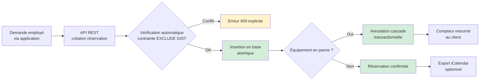

```mermaid
flowchart LR
    A[Demande employé<br/>via application] --> B[API REST<br/>création réservation]
    B --> C{Vérification automatique<br/>contrainte EXCLUDE GIST}
    C -- Conflit --> 
    D[Erreur 409 explicite]
    C -- OK --> E[Insertion en base<br/>atomique]
    E --> F{Équipement en panne ?}
    F -- Oui --> G[Annulation cascade<br/>transactionnelle]
    F -- Non --> H[Réservation confirmée]
    G --> I[Compteur retourné<br/>au client]
    H --> J[Export iCalendar<br/>optionnel]
    
	style D fill:#fff3cd
	style E fill:#d4edda
	style G fill:#d4edda
	style H fill:#d4edda
```