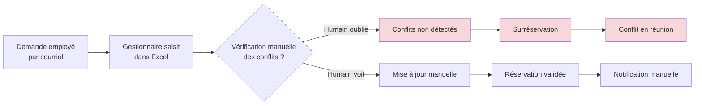

```mermaid

flowchart LR
    A["Demande employé<br>par courriel"] --> B["Gestionnaire saisit<br>dans Excel"]
    B --> C{"Vérification manuelle<br>des conflits ?"}
    C -- Humain oublie --> D["Conflits non détectés"]
    C -- Humain voit --> E["Mise à jour manuelle"]
    D --> F["Surréservation"]
    E --> G["Réservation validée"]
    F --> H["Conflit en réunion"]
    G --> I["Notification manuelle"]

    style D fill:#f8d7da
    style F fill:#f8d7da
    style H fill:#f8d7da

```