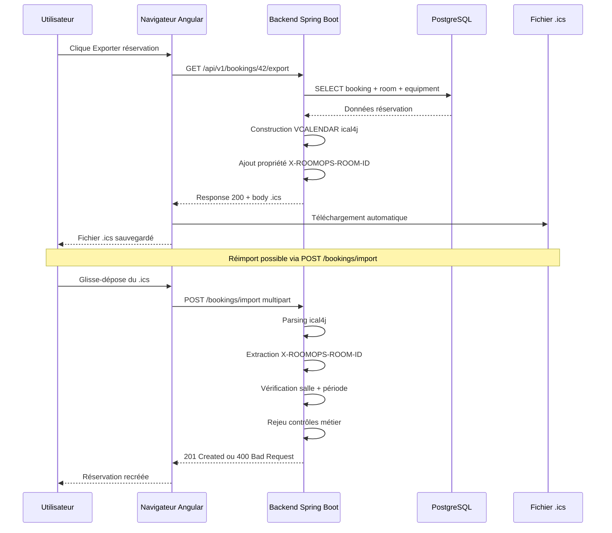

```mermaid
sequenceDiagram
    participant U as Utilisateur
    participant F as Navigateur Angular
    participant B as Backend Spring Boot
    participant DB as PostgreSQL
    participant FS as Fichier .ics

    U->>F: Clique Exporter réservation #42
    F->>B: GET /api/v1/bookings/42/export
    B->>DB: SELECT booking + room + equipment
    DB-->>B: Données réservation
    B->>B: Construction VCALENDAR ical4j
    B->>B: Ajout propriété X-ROOMOPS-ROOM-ID
    B-->>F: Response 200 + body .ics
    F->>FS: Téléchargement automatique
    F-->>U: Fichier .ics sauvegardé

    Note over U,FS: Réimport possible via POST /bookings/import

    U->>F: Glisse-dépose du .ics
    F->>B: POST /bookings/import multipart
    B->>B: Parsing ical4j
    B->>B: Extraction X-ROOMOPS-ROOM-ID
    B->>B: Vérification salle + période
    B->>B: Rejeu contrôles métier
    B-->>F: 201 Created ou 400 Bad Request
    F-->>U: Réservation recréée
```