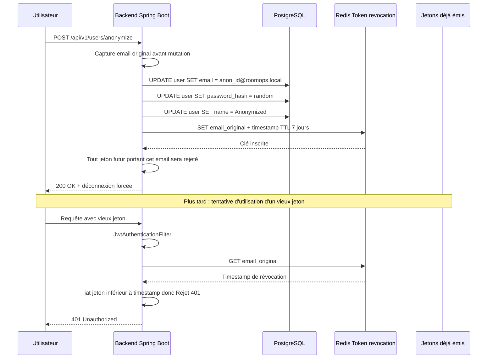

```mermaid

sequenceDiagram
    participant U as Utilisateur
    participant B as Backend Spring Boot
    participant DB as PostgreSQL
    participant R as Redis Token revocation
    participant JWT as Jetons déjà émis

    U->>B: POST /api/v1/users/anonymize
    B->>B: Capture email original avant mutation
    B->>DB: UPDATE user SET email = anon_id@roomops.local
    B->>DB: UPDATE user SET password_hash = random
    B->>DB: UPDATE user SET name = Anonymized
    B->>R: SET email_original + timestamp TTL 7 jours
    R-->>B: Clé inscrite
    B->>B: Tout jeton futur portant cet email sera rejeté
    B-->>U: 200 OK + déconnexion forcée

    Note over U,JWT: Plus tard : tentative d'utilisation d'un vieux jeton

    U->>B: Requête avec vieux jeton
    B->>B: JwtAuthenticationFilter
    B->>R: GET email_original
    R-->>B: Timestamp de révocation
    B->>B: iat jeton inférieur à timestamp donc Rejet 401
    B-->>U: 401 Unauthorized

```