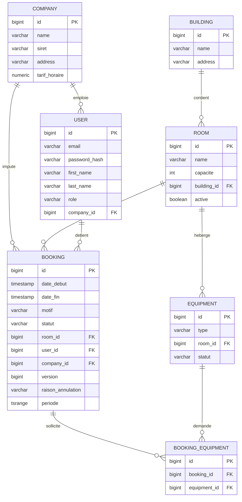

```mermaid

erDiagram
    COMPANY ||--o{ USER : emploie
    COMPANY ||--o{ BOOKING : impute
    BUILDING ||--o{ ROOM : contient
    ROOM ||--o{ EQUIPMENT : heberge
    ROOM ||--o{ BOOKING : accueille
    USER ||--o{ BOOKING : detient
    BOOKING ||--o{ BOOKING_EQUIPMENT : sollicite
    EQUIPMENT ||--o{ BOOKING_EQUIPMENT : demande

    COMPANY {
        bigint id PK
        varchar name
        varchar siret
        varchar address
        numeric tarif_horaire
    }

    USER {
        bigint id PK
        varchar email
        varchar password_hash
        varchar first_name
        varchar last_name
        varchar role
        bigint company_id FK
    }

    BUILDING {
        bigint id PK
        varchar name
        varchar address
    }

    ROOM {
        bigint id PK
        varchar name
        int capacite
        bigint building_id FK
        boolean active
    }

    EQUIPMENT {
        bigint id PK
        varchar type
        bigint room_id FK
        varchar statut
    }

    BOOKING {
        bigint id PK
        timestamp date_debut
        timestamp date_fin
        varchar motif
        varchar statut
        bigint room_id FK
        bigint user_id FK
        bigint company_id FK
        bigint version
        varchar raison_annulation
        tsrange periode
    }

    BOOKING_EQUIPMENT {
        bigint id PK
        bigint booking_id FK
        bigint equipment_id FK
    }
```