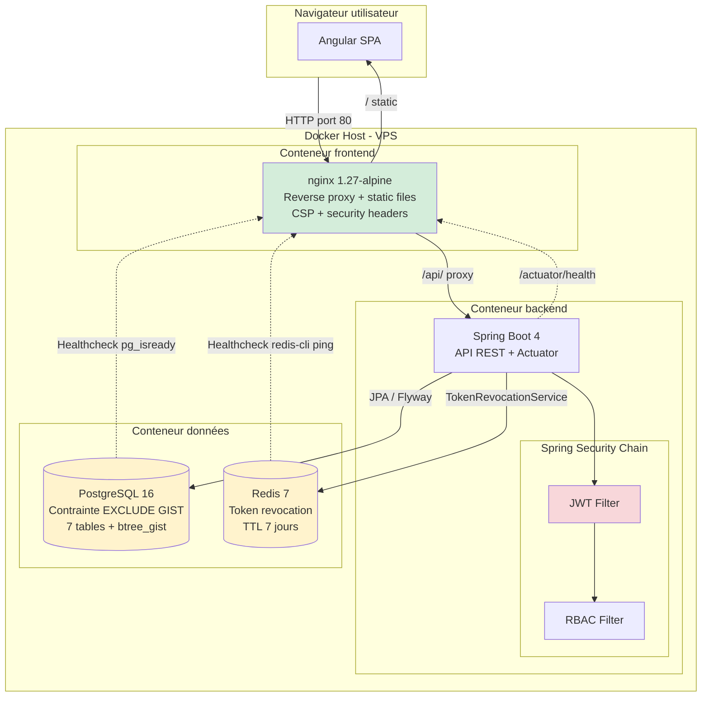

```mermaid

flowchart TB
    subgraph Client[Navigateur utilisateur]
        UI[Angular SPA]
    end

    subgraph Docker[Docker Host - VPS]
        subgraph Frontend[Conteneur frontend]
            NGINX["nginx 1.27-alpine<br/>Reverse proxy + static files<br/>CSP + security headers"]
        end

        subgraph Backend[Conteneur backend]
            SB["Spring Boot 4<br/>API REST + Actuator"]
            subgraph Spring[Spring Security Chain]
                JWT[JWT Filter]
                RBAC[RBAC Filter]
            end
        end

        subgraph Data[Conteneur données]
            PG[("PostgreSQL 16<br/>Contrainte EXCLUDE GIST<br/>7 tables + btree_gist")]
            RD[("Redis 7<br/>Token revocation<br/>TTL 7 jours")]
        end
    end

    Client -->|HTTP port 80| NGINX
    NGINX -->|/api/ proxy| SB
    NGINX -->|/ static| UI
    SB --> JWT
    JWT --> RBAC
    SB -->|JPA / Flyway| PG
    SB -->|TokenRevocationService| RD
    SB -.->|/actuator/health| NGINX
    RD -.->|Healthcheck redis-cli ping| NGINX
    PG -.->|Healthcheck pg_isready| NGINX

    style NGINX fill:#d4edda
    style PG fill:#fff3cd
    style RD fill:#fff3cd
    style JWT fill:#f8d7da

```