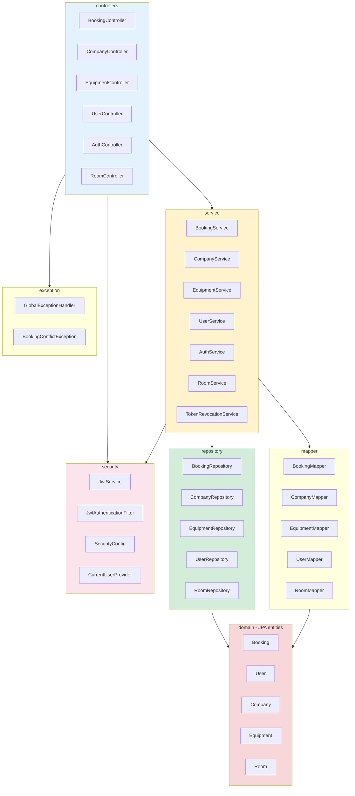

```mermaid

flowchart TB
    subgraph Controllers[controllers]
        BC[BookingController]
        CC[CompanyController]
        EC[EquipmentController]
        UC[UserController]
        AuthC[AuthController]
        RoomC[RoomController]
    end

    subgraph Services[service]
        BS[BookingService]
        CS[CompanyService]
        ES[EquipmentService]
        US[UserService]
        AS[AuthService]
        RS[RoomService]
        TRS[TokenRevocationService]
    end

    subgraph Repositories[repository]
        BR[BookingRepository]
        CR[CompanyRepository]
        ER[EquipmentRepository]
        UR[UserRepository]
        RR[RoomRepository]
    end

    subgraph Domain[domain - JPA entities]
        BE[Booking]
        UE[User]
        CE[Company]
        EE[Equipment]
        RE[Room]
    end

    subgraph Mappers[mapper]
        BM[BookingMapper]
        CM[CompanyMapper]
        EM[EquipmentMapper]
        UM[UserMapper]
        RM[RoomMapper]
    end

    subgraph Security[security]
        JWT[JwtService]
        FILT[JwtAuthenticationFilter]
        CFG[SecurityConfig]
        CUP[CurrentUserProvider]
    end

    subgraph Exception[exception]
        HEG[GlobalExceptionHandler]
        BKE[BookingConflictException]
    end

    Controllers --> Services
    Services --> Repositories
    Services --> Mappers
    Repositories --> Domain
    Mappers --> Domain
    Controllers --> Security
    Services --> Security
    Controllers --> Exception

    style Controllers fill:#e3f2fd
    style Services fill:#fff3cd
    style Repositories fill:#d4edda
    style Domain fill:#f8d7da
    style Security fill:#fce4ec

```